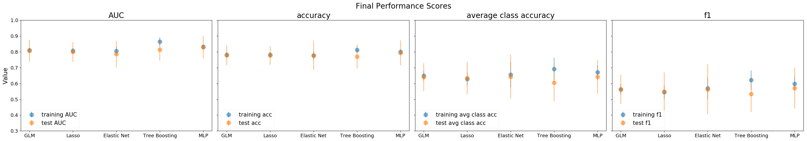
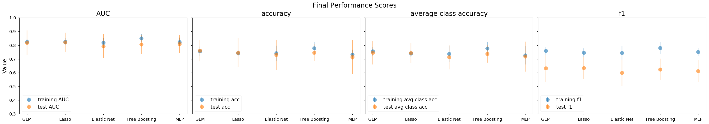
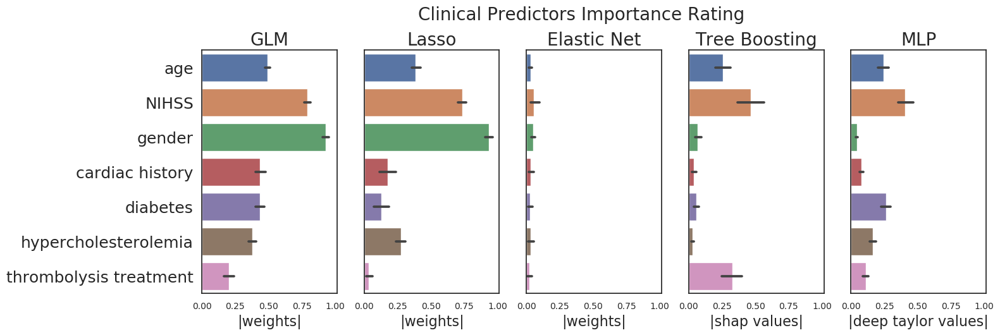
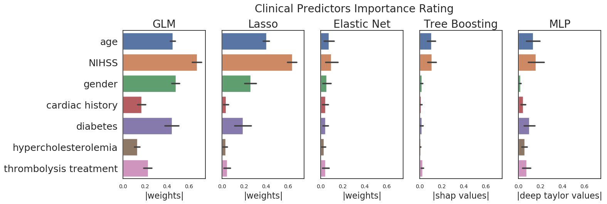

This file includes full and continuously updated documentation of the Outcome Prediction: Sub-model 1.

Goal: Prediction of final outcome based on only clinical parameters

## Literature Review

**Link to summary table**: [literature review on parameters rating](literature/literature_review_on_parameters_rating.ods)

## The Model:

__Database:__  
1. 1000plus with DWI lesion volume (314 patients)
2. 1000plus (314 patients)
3. SUplus (1034 patients) 
4. SUplus treated patients (239 patients)

__All information presented in this documentation is based on the 1000plus with DWI lesion volume dataset. The same analyses, model training and evaluation have been done for all four datasets and can be found in the repository.__

__Input:__ Clinical parameters (8)

AD_NIH: NIHSS at admission
AT_LY: thrombolysis
CH: history of cardiac diseases
DG_SEX: gender
RF_DM: diabetes
RF_HC: hypercholesterolemia
DG_AG: age
DWI: acute DWI lesion volume

* The below table presents the clinical characteristics of 1000plus with DWI lesion volume. Characteristics of other datasets can be found under [this folder.](data_analysis/data_statistics):

| Clinical Information             | Value       | Abbreviation | Clinical Information           | Value    | Abbreviation | 
|----------------------------------|-------------|--------------|--------------------------------|----------|--------------| 
| Median age (IQR)                 | 72.0 (15.0) | DG_AG        | Cardiac history (yes/ no)      | 84/ 230  | CH           | 
| Median Initial NIHSS (IQR)       | 3 (5)       | AD_NIH       | Diabetes (yes/ no)             | 79/ 235  | RF_DM        | 
| Thrombolysis (yes/ no)           | 74/ 240     | AT_LY        | Hypercholesterolemia (yes/ no) | 182/ 132 | RF_HC        | 
| Females/ males                   | 196/ 118    | DG_SEX       | 								 |          |              |
 

__Output:__ 3 months post-stroke outcome (good (mrs<=2) : 226 patients , bad (mrs>=3) : 88 patients)

__Criteria:__

Exclusion criteria for patients: NaN value for outcome
                                 reoccuring stroke within the three month
                                 reinfarction during hospital stay
                                 
Inclusion criteria for parameters: at least 1 to 4 ratio for binary variables
                                   at most 5% NaN-values (NaN-values are filled with mean approach)
                                   
__Applied models:__ regularized logistic regression (LASSO,Elastic Nets), tree-boosting (CATboost package)

## Sub-analysis 1: Handling NaN values - comparison of methods
Goal: Compare different methods to handle missing value in clinical dataset and assess based on real data (1000plus DB) what is the method 
that yields the best results
Methods to be compared:
<add list of methods here>
analysis description: 
* Normalizing the data
* assigning randomly NaN values to 1-20% of data
* Filling the missing values with each of the methods
* comparing results of the different methods (MSE)

## Sub-analysis 2: Multicollinearity analysis
The VIF will be calculated for each of the input-features. To avoid the effect of multicollinearity on parameters rating, input-features with 
VIF>10 will be kicked out from the parameters rating analysis.[1] To check the validity of the features-selection we'll compare the results to 
the feature-selection in LASSO analysis. Additionally we'll examine the covariance/autocorrelation matrix of the input features.

Additional information on VIF interpretation:  https://link.springer.com/article/10.1007/s11135-006-9018-6

Results: 
* a. The VIF analysis showed that there is no strong collinearity between any of the parameters (VIF<10). The VIF values were smaller 
            than 2.5 for all the parameters included in the model, thus none was kicked out. The python code to calculate the multicollinearities 
            is [calc_multicollinearities.py](calc_multicollinearities.py)

*   * The below table presents the VIF values for 1000plus with DWI lesion volume. VIF values for other datasets can be found under [this folder.](data_analysis/multicollinearity_analysis)

|  Predictor Name | AD_NIH        | CH   | DG_SEX | RF_DM | RF_HC | DG_AG | AT_LY | 
|-----------------|---------------|------|--------|-------|-------|-------|-------|
|  VIF            | 1.28          | 1.33 | 1.91   | 1.36  | 1.74  | 1.15  | 1.50  |

* b. For investigating (pairwise) correlation the phi coefficient was used in order to get meaningful results with categorical data. 
            Phi coefficient, also known as the Matthews coefficient, is a measure of association between two binary variables and a 
            |Phi value| > 0.3 indicates a correlation between two variables. Analysis shows that there is a  correlation between the 
            parameters 'smoker' and 'former smoker' (phi value = 0.45). Nonetheless both parameters were kept in the analysis due to not too 
            high correlations as well as confirmation by the VIF. The relevant python code and tables can be found in the "Multicollinearity 
            Analysis" repository.

[1] Kutner, M. H.; Nachtsheim, C. J.; Neter, J. (2004). Applied Linear Regression Models (4th ed.). McGraw-Hill Irwin

## Sub-analysis 3: Subsampling
Goal: Subsample the dataset in order to have balanced labels, i.e achieve equal number of good and bad outcome in the output

Methods: 
* 1. No subsampling
* 2. Random subsampling: Get all the patients labeled with the minority group. Randomly select the exact number of patients from the 
	        ones labeled with the majority group.
* 3. Optimized subsampling: Select around twice the count of the minority group from the whole dataset in a way that assures no 
	        strong imbalance for the categorical predictors in the selected group. For this we solve a generic constrained optimization 
	        problem, where the loss function is defined as the mean squared distance of the empirical distribution from the categorical 
	        predictors in the data to a perfectly even distribution. A variable is used to decide whether to select a patient or not and to 
	        define the constraint on the problem which is the number of patients to be selected in total. This is implemented by using the 
	        cvxpy library in Python. The relevant Python code can be found under the [subsampling.py](subsampling.py). The algorithm was suggested by 
            Boris 

## Cross-validation Design:
* 4/1 ratio for the training-test split in one run. Same training and test sets used for all models. For the balanced datasets training and 
test sets are assured to be balanced too.
* 10 fold split on the training set on each run for performing cross validation. Same training and validation sets used for all models.
For the balanced datasets training and validation sets are assured to be balanced too.
* All parameters except the tuned ones (learning rate, tolerance etc.) are same for all the linear models.
* For measuring performance AUC scores on the whole training and test set is evaluated for each model in 1 run.
* The final performance is the mean, standard deviation as well as the median and iqr of the AUC scores computed through 50 runs.

## Sub-analysis 4: Linear predictive models: GLM, Lasso, Elastic Nets
Regularized logistic regression models were trained to get the best baseline performance for outcome prediction using only clinical data. 
A nonregulized general linear model was used in order to see if there is a significant difference through the regularization term with our 
dataset. The performance is based on the AUC score of the test set. Another important goal was to find the most important features, i.e. 
clinical parameters for acute-stroke outcome prediction.

Methods: 
* a. GLM (General Linear Model): A logistic regression model with no regularization term was implemented using sklearn's 
            LogisticRegression class. Additionally p values of the features were calculated to determine the significant clinical parameters.
* b. Lasso: A logistic regression model with L1 regularization was implemented using sklearn's LogisticRegression. The strength of 
	        the regularization was adjusted using a tuning parameter alpha, through 10-fold cross validation. The best alpha is chosen 
	        based on the average of the AUC scores on the validation sets. Additionaly feature importance was explored using the nature of 
	        L1 regularization which assigns zero weights to features with no importance for the model. For each run, each feature was 
	        assigned 0 or 1 depending on whether it was kicked out from the model (assigned zero weight) or not and the final counts were 
	        plotted as a bar plot. Thus, higher counts represent the important clinical parameters.
* c. Elactic Nets:  A logistic regression model with both L1 and L2 regularization was implemented using sklearn's SGDClassifier 
	        class. The strength of the different regularizations was adjusted using tuning parameters alpha and gamma, through 10-fold 
	        cross validation. The best alpha and gamma are chosen based on the average of the AUC scores on the validation sets.

Results:

* The below table presents the performance results for 1000plus. Results of other datasets can be found under [this folder.](modeling_results/)

| Subsampling Type | Model      | Value  | AUC (tr) | AUC (test) | accuracy (tr) | accuracy (test) | avg class accuracy (tr) | avg class accuracy (test) | f1 (tr) | f1 (test) | 
|------------------|------------|--------|----------|------------|---------------|-----------------|-------------------------|---------------------------|---------|-----------| 
| none             | GLM        | median | 0.81     | 0.81       | 0.78          | 0.78            | 0.65                    | 0.64                      | 0.56    | 0.56      | 
|                  |            | iqr    | 0.02     | 0.07       | 0.02          | 0.06            | 0.03                    | 0.09                      | 0.03    | 0.09      | 
|                  | Lasso      | median | 0.81     | 0.80       | 0.78          | 0.78            | 0.63                    | 0.63                      | 0.55    | 0.55      | 
|                  |            | iqr    | 0.02     | 0.06       | 0.02          | 0.06            | 0.04                    | 0.10                      | 0.04    | 0.12      | 
|                  | Elasticnet | median | 0.81     | 0.79       | 0.78          | 0.78            | 0.65                    | 0.64                      | 0.57    | 0.56      | 
|                  |            | iqr    | 0.03     | 0.08       | 0.03          | 0.09            | 0.08                    | 0.14                      | 0.07    | 0.16      | 
| random           | GLM        | median | 0.83     | 0.82       | 0.76          | 0.76            | 0.76                    | 0.75                      | 0.76    | 0.63      | 
|                  |            | iqr    | 0.02     | 0.09       | 0.03          | 0.08            | 0.03                    | 0.09                      | 0.03    | 0.10      | 
|                  | Lasso      | median | 0.83     | 0.82       | 0.74          | 0.75            | 0.74                    | 0.74                      | 0.75    | 0.63      | 
|                  |            | iqr    | 0.03     | 0.07       | 0.02          | 0.11            | 0.03                    | 0.07                      | 0.03    | 0.08      | 
|                  | Elasticnet | median | 0.82     | 0.79       | 0.74          | 0.73            | 0.74                    | 0.71                      | 0.74    | 0.60      | 
|                  |            | iqr    | 0.04     | 0.09       | 0.06          | 0.11            | 0.06                    | 0.09                      | 0.05    | 0.10      | 

## Sub-analysis 5: Non-linear predictive model: Catboost
A tree-boosting model is implemented using Catboost package for python. Information on installation and how to use the package can be found here: 
https://tech.yandex.com/catboost/. The parameter for optimal tree count is tuned first, using the test set as the evaluation set and logloss as 
the evaluation metric. This evaluation is done to prevent overfitting that can result from starting with a high number of trees. Afterwards the 
L2 regularization term, tree depth, learning rate and bagging temperature are tuned using a 10 fold cross validation. The best parameters are 
chosen based on the average of the AUC scores on the validation sets. Additionaly the rating of predictors are evaluated using a built in method 
of Catboost for calculated parameter importance. For this calculation the algortihm is trained on the whole dataset using best parameters obtained 
from a random run.

Results:

* The below table presents the performance results for 1000plus. Results of other datasets can be found under [this folder.](modeling_results/)

| Subsampling Type | Model      | Value  | AUC (tr) | AUC (test) | accuracy (tr) | accuracy (test) | avg class accuracy (tr) | avg class accuracy (test) | f1 (tr) | f1 (test) | 
|------------------|------------|--------|----------|------------|---------------|-----------------|-------------------------|---------------------------|---------|-----------| 
| none             | Catboost   | median | 0.86     | 0.81       | 0.81          | 0.77            | 0.69                    | 0.60                      | 0.62    | 0.53      | 
|                  |            | iqr    | 0.03     | 0.07       | 0.02          | 0.08            | 0.07                    | 0.12                      | 0.06    | 0.11      | 
| random           | Catboost   | median | 0.85     | 0.81       | 0.78          | 0.75            | 0.78                    | 0.74                      | 0.78    | 0.62      | 
|                  |            | iqr    | 0.03     | 0.07       | 0.04          | 0.06            | 0.05                    | 0.06                      | 0.04    | 0.08      |  

## Sub-analysis 6: Non-linear predictive model: Multilayer Perceptron (MLP)

Results:

* The below table presents the performance results for 1000plus. Results of other datasets can be found under [this folder.](modeling_results/)

| Subsampling Type | Model      | Value  | AUC (tr) | AUC (test) | accuracy (tr) | accuracy (test) | avg class accuracy (tr) | avg class accuracy (test) | f1 (tr) | f1 (test) | 
|------------------|------------|--------|----------|------------|---------------|-----------------|-------------------------|---------------------------|---------|-----------| 
| none             | MLP        | median | 0.83     | 0.83       | 0.80          | 0.79            | 0.67                    | 0.64                      | 0.60    | 0.57      | 
|                  |            | iqr    | 0.01     | 0.07       | 0.02          | 0.08            | 0.05                    | 0.11                      | 0.04    | 0.13      | 
| random           | MLP        | median | 0.82     | 0.81       | 0.73          | 0.71            | 0.73                    | 0.72                      | 0.75    | 0.61      | 
|                  |            | iqr    | 0.03     | 0.07       | 0.04          | 0.12            | 0.07                    | 0.11                      | 0.03    | 0.08      |  

## All performance results:

### 1. None subsampling

### 2. Random subsampling

## Sub-analysis 7: Clinical parameters rating
As discussed in the model analysis parts above, we try to understand the clinical parameters rating using 3 different methods. 

Methods:
* 1. Using the weights assigned to input features in the trained GLM, Lasso and Elasticnet models.
* 2. Using shapley values for systematically rating the importance (gain) of each of the input features in the trained Catboost model.
* 3. Using deep Taylor expansion to find salient features in the trained MLP model.

Results:

* The numerical values for weights, shapley, deep taylor expansion can be found under [this folder.](modeling_results/1kplus/weights/)

### 1. None subsampling

### 2. Random subsampling

