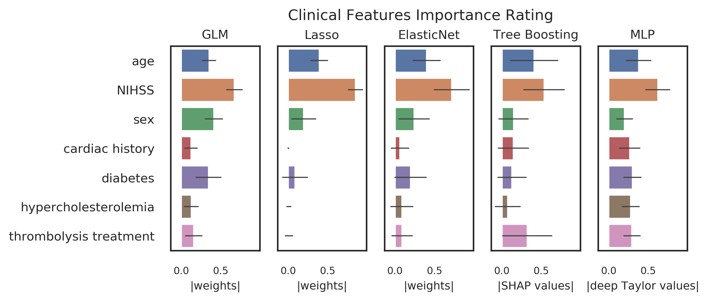

# Opening the Black Box of Artificial Intelligence for Clinical Decision Support: A Study Predicting Stroke Outcome 

This repository contains the implementation and evaluation of linear (GLM, Lasso and Elastic Net) and non-linear (Tree Boosting and Multilayer Perceptron) models for predicting stroke outcome in acute-ischemic patients; as well as the implementation of explainability methods to determine clinical predictors (features) importance for outcome prediction. 

## Data
314 patients with acute ischemic stroke from the 1000plus study were included. Currently the clinical data cannot be made publicly accessible due to data protection.

__Input:__ Clinical predictors (features) (7)

    AD_NIH: NIHSS at admission
    AT_LY: thrombolysis
    CH: history of cardiac diseases
    DG_SEX: gender
    RF_DM: diabetes
    RF_HC: hypercholesterolemia
    DG_AG: age

__Output:__ 3 months post-stroke mRS score (good (mrs<=2) : 226 patients , bad (mrs>=3) : 88 patients)

__Exclusion Criteria:__

* Patients with no mRS information were excluded.
* Patients with infratentorial stroke and no visible DWI lesions were excluded.
* Clinical predictors with more than 5% missing values were excluded.
* Categorical clinical predictors with a yes/no ratio larger than 1/4 were excluded, in order to prevent category imbalance.
                                 

The table below presents the clinical characteristics of the 1000plus dataset.

| Clinical Information             | Value       | Clinical Information           | Value    | 
|----------------------------------|-------------|--------------------------------|----------|
| Median age (IQR)                 | 72.0 (15.0) | Cardiac history (yes/ no)      | 84/ 230  | 
| Median Initial NIHSS (IQR)       | 3 (5)       | Diabetes (yes/ no)             | 79/ 235  | 
| Thrombolysis (yes/ no)           | 74/ 240     | Hypercholesterolemia (yes/ no) | 182/ 132 |  
| Females/ males                   | 196/ 118    | 								                |          |

The figures below show the distribution of continuous and categorical predictors in the 1000plus dataset.

## Methods:

### Data Preprocessing
* The continuous predictors were centered using zero-mean unit-variance normalization.
* Missing values were imputed using mean imputation

### Multicollinearity analysis
The Variance Inflation Factor (VIF) was calculated for each of the clinical predictors to measure multicollinearity. The VIF analysis demonstrated negligible multicollinearity with VIFs < 1.91. The calculated VIF values for each predictor is given in the table below.

|  Predictor Name | AD_NIH  | CH   | DG_SEX | RF_DM | RF_HC | DG_AG | AT_LY | 
|-----------------|---------|------|--------|-------|-------|-------|-------|
|  VIF            | 1.28    | 1.33 | 1.91   | 1.36  | 1.74  | 1.15  | 1.50  |

### Cross-validation Design
* The data was split into training and test sets with a 4/1 ratio. Same training and test sets were used in all models to achieve comparable results. 
* The models were tuned, i.e best hyperparameters were selected, using 10-folds cross-validation with gridsearch. Same folds were used for all models to achieve comparable results.
* In order to account for data variability the above process was repeated 50 times; resulting in 50 splits tuned separately for each model.
* The final performance is the mean, standard deviation as well as the median and iqr of the training and test AUC scores computed over 50 splits.

### Subsampling
To target class imbalance, the training set was randomly sub-sampled to yield equal number of label classes, i.e equal number of patients with good and bad outcome.

### Linear predictive models: GLM, Lasso, Elastic Nets
1. GLM (General Linear Model): A logistic regression model with no regularization term was implemented using sklearn's LogisticRegression class. 
            
2. Lasso: A logistic regression model with L1 regularization was implemented using sklearn's LogisticRegression class. The strength of the regularization was adjusted using a tuning hyperparameter alpha. The best value of alpha was chosen during model tuning. 

3. Elactic Nets:  A logistic regression model with both L1 and L2 regularization was implemented using sklearn's SGDClassifier class. The strength of the different regularizations was adjusted using tuning hyperparameters alpha and gamma. The best values of alpha and gamma were chosen during model tuning.

### Non-linear predictive model: Tree Boosting
A tree-boosting model is implemented using the Catboost package for python. Information on installation and how to use the package can be found here: https://tech.yandex.com/catboost/. The parameter for optimal tree count was automatically tuned by setting the overfitting detection parameters of the package. The best values of the L2 regularization term, tree depth, learning rate, leaf estimation iterations and bagging temperature were chosen during model tuning.

### Non-linear predictive model: Multilayer Perceptron (MLP)

### Clinical parameters rating
Three different explainability methods tailored to the different ML algorithms were used to calculate importance values for the clinical predictors used in the scope of this project. 

1. GLM, Lasso and Elastic Net: Weights assigned to input features (predictors) in the trained GLM, Lasso and Elasticnet models were used as feature impoartance values.
2. Tree Boosting (Catboost): Shapley values were used for systematically rating the importance (gain) of each of the input features (predictors) in the trained Catboost model. Shapley values were obtained using the Python package [SHAP](https://github.com/slundberg/shap)
3. MLP: A gradient based algorithm called deep Taylor decomposition was used to find salient features in the trained MLP model. The gradients were obtained using the Python package [INNvestigate](https://github.com/albermax/innvestigate).

The absolute values of the calculated feature importance scores were scaled to unit norm in order to provide comparable feature rating across models. Then, for each feature the mean and standard deviation over the splits were calculated.

## Results:

### 1. Performance Results

The table below presents the performance results calculated as AUC scores over 50 splits.

| Model      | Value  | AUC (training) | AUC (test) | 
|------------|--------|----------------|------------|
| GLM        | median | 0.83           | 0.82       |
|            | iqr    | 0.02           | 0.09       |
| Lasso      | median | 0.83           | 0.82       | 
|            | iqr    | 0.03           | 0.07       | 
| ElasticNet | median | 0.82           | 0.79       | 
|            | iqr    | 0.04           | 0.09       | 
| Catboost   | median | 0.85           | 0.81       | 
|            | iqr    | 0.03           | 0.07       | 
| MLP        | median | 0.82           | 0.81       | 
|            | iqr    | 0.03           | 0.07       | 

### 2. Clinical Predictors Importance Ratings

## Manual
Manual to this framework can be found [here](manual.md).

## License
This project is licensed under the [MIT license](LICENSE).

