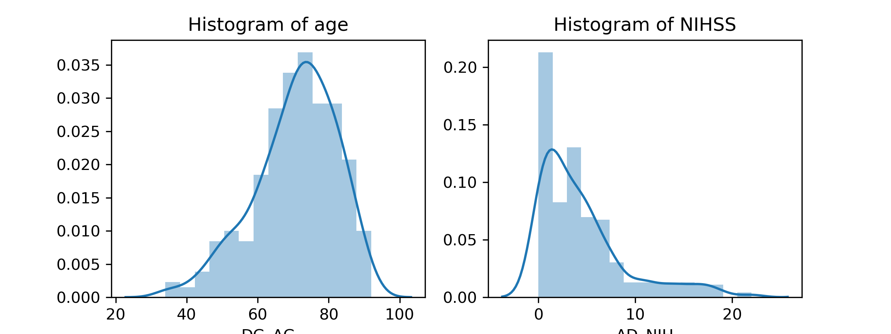
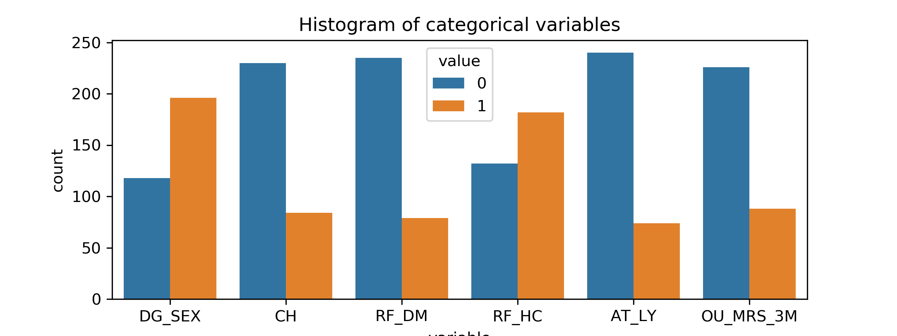

# Opening the Black Box of Artificial Intelligence for Clinical Decision Support: A Study Predicting Stroke Outcome 

## Data
1000plus

__Input:__ Clinical parameters (7)

AD_NIH: NIHSS at admission
AT_LY: thrombolysis
CH: history of cardiac diseases
DG_SEX: gender
RF_DM: diabetes
RF_HC: hypercholesterolemia
DG_AG: age

__Output:__ 3 months post-stroke outcome (good (mrs<=2) : 226 patients , bad (mrs>=3) : 88 patients)

* The below table presents the clinical characteristics of the 1000plus dataset.

| Clinical Information             | Value       | Abbreviation | Clinical Information           | Value    | Abbreviation | 
|----------------------------------|-------------|--------------|--------------------------------|----------|--------------| 
| Median age (IQR)                 | 72.0 (15.0) | DG_AG        | Cardiac history (yes/ no)      | 84/ 230  | CH           | 
| Median Initial NIHSS (IQR)       | 3 (5)       | AD_NIH       | Diabetes (yes/ no)             | 79/ 235  | RF_DM        | 
| Thrombolysis (yes/ no)           | 74/ 240     | AT_LY        | Hypercholesterolemia (yes/ no) | 182/ 132 | RF_HC        | 
| Females/ males                   | 196/ 118    | DG_SEX       | 								 |          |              |
 

## Methods:
 
